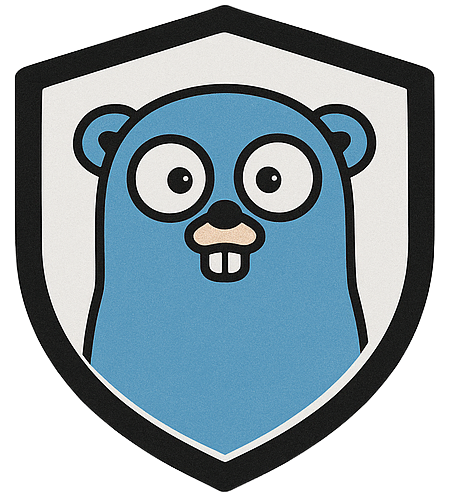

<div align="center">
  
  
  # grd
  
  [](https://pkg.go.dev/github.com/imadselka/grd)
  [](https://goreportcard.com/report/github.com/imadselka/grd)
  [](https://codecov.io/gh/imadselka/grd)
  [](https://github.com/imadselka/grd/actions)
  [](https://github.com/imadselka/grd)
  [](https://opensource.org/licenses/MIT)
  [](https://github.com/avelino/awesome-go)
</div>

A lightweight Go library providing monadic error handling with chainable operations. Eliminate verbose error checking and build readable, composable error-handling pipelines.

## Features

- **🔗 Chainable Operations**: Chain multiple operations without explicit error checks
- **⚡ Zero Dependencies**: Pure Go, no external dependencies
- **🔄 Generic Types**: Full type safety with Go generics
- **🛡️ Error Short-Circuiting**: Automatic error propagation through chains
- **🏁 Finally Blocks**: Guaranteed cleanup execution

## Installation

```bash
go get github.com/imadselka/grd
```

## Quick Start

```go
import "github.com/imadselka/grd"

result := grd.Try(func() (string, error) {
    return fetchUserData(userID)
}).Then(func(userData string) (string, error) {
    return processUserData(userData)
}).Then(func(processed string) (string, error) {
    return saveToDatabase(processed)
}).Catch(func(err error) string {
    log.Printf("Operation failed: %v", err)
    return "default_value"
})
```

## API Reference

### `Try[T](fn func() (T, error)) *TryResult[T]`
Creates a new TryResult from a function that returns a value and error.

### `Then(fn func(T) (T, error)) *TryResult[T]`
Chains another operation. Skipped if previous operation failed.

### `Catch(fn func(error) T) T`
Handles errors and provides fallback value. Always returns a value.

### `Finally(fn func()) *TryResult[T]`
Executes cleanup code regardless of success/failure.

## Real-World Examples

### File Processing Pipeline

```go
func ProcessConfigFile(filepath string) string {
    return grd.Try(func() ([]byte, error) {
        return os.ReadFile(filepath)
    }).Then(func(data []byte) (map[string]interface{}, error) {
        var config map[string]interface{}
        return config, json.Unmarshal(data, &config)
    }).Then(func(config map[string]interface{}) (string, error) {
        validated := validateConfig(config)
        return json.Marshal(validated)
    }).Finally(func() {
        log.Println("Config processing completed")
    }).Catch(func(err error) string {
        log.Printf("Config processing failed: %v", err)
        return "{}"
    })
}
```

### HTTP API Client

```go
type User struct {
    ID   int    `json:"id"`
    Name string `json:"name"`
}

func FetchAndTransformUser(userID int) User {
    return grd.Try(func() (*http.Response, error) {
        return http.Get(fmt.Sprintf("/api/users/%d", userID))
    }).Then(func(resp *http.Response) ([]byte, error) {
        defer resp.Body.Close()
        if resp.StatusCode != 200 {
            return nil, fmt.Errorf("API error: %d", resp.StatusCode)
        }
        return io.ReadAll(resp.Body)
    }).Then(func(data []byte) (User, error) {
        var user User
        return user, json.Unmarshal(data, &user)
    }).Then(func(user User) (User, error) {
        // Transform user data
        user.Name = strings.Title(strings.ToLower(user.Name))
        return user, nil
    }).Finally(func() {
        metrics.IncrementAPICall("fetch_user")
    }).Catch(func(err error) User {
        log.Printf("Failed to fetch user %d: %v", userID, err)
        return User{ID: -1, Name: "Unknown"}
    })
}
```

### Database Transaction

```go
func TransferMoney(from, to int, amount decimal.Decimal) bool {
    return grd.Try(func() (*sql.Tx, error) {
        return db.Begin()
    }).Then(func(tx *sql.Tx) (*sql.Tx, error) {
        _, err := tx.Exec("UPDATE accounts SET balance = balance - ? WHERE id = ?", amount, from)
        return tx, err
    }).Then(func(tx *sql.Tx) (*sql.Tx, error) {
        _, err := tx.Exec("UPDATE accounts SET balance = balance + ? WHERE id = ?", amount, to)
        return tx, err
    }).Then(func(tx *sql.Tx) (bool, error) {
        return true, tx.Commit()
    }).Finally(func() {
        // Log transaction attempt
        auditLog.Record("transfer_attempt", from, to, amount)
    }).Catch(func(err error) bool {
        log.Printf("Transfer failed: %v", err)
        return false
    })
}
```

### Validation Chain

```go
func ValidateAndCreateUser(input UserInput) (*User, error) {
    result := grd.Try(func() (UserInput, error) {
        return input, validateEmail(input.Email)
    }).Then(func(input UserInput) (UserInput, error) {
        return input, validatePassword(input.Password)
    }).Then(func(input UserInput) (UserInput, error) {
        exists, err := checkEmailExists(input.Email)
        if err != nil {
            return input, err
        }
        if exists {
            return input, errors.New("email already exists")
        }
        return input, nil
    }).Then(func(input UserInput) (*User, error) {
        return createUser(input)
    }).Finally(func() {
        metrics.IncrementCounter("user_creation_attempts")
    })

    // Handle the result
    user := result.Catch(func(err error) *User {
        log.Printf("User creation failed: %v", err)
        return nil
    })
    
    if user == nil {
        return nil, errors.New("failed to create user")
    }
    return user, nil
}
```

## Pattern Comparison

### Before (Traditional Go)
```go
func ProcessData(input string) (string, error) {
    data, err := fetchData(input)
    if err != nil {
        return "", fmt.Errorf("fetch failed: %w", err)
    }
    
    processed, err := transformData(data)
    if err != nil {
        return "", fmt.Errorf("transform failed: %w", err)
    }
    
    result, err := saveData(processed)
    if err != nil {
        return "", fmt.Errorf("save failed: %w", err)
    }
    
    return result, nil
}
```

### After (With grd)
```go
func ProcessData(input string) string {
    return grd.Try(func() (string, error) {
        return fetchData(input)
    }).Then(func(data string) (string, error) {
        return transformData(data)
    }).Then(func(processed string) (string, error) {
        return saveData(processed)
    }).Catch(func(err error) string {
        log.Printf("Processing failed: %v", err)
        return ""
    })
}
```

## Best Practices

1. **Use meaningful error messages in Catch blocks**
2. **Leverage Finally for cleanup (logging, metrics, resource cleanup)**
3. **Keep transformation functions pure when possible**
4. **Chain related operations for better readability**
5. **Consider the return type of your final Catch handler**

## Performance

grd adds minimal overhead to your error handling. Benchmark results show negligible performance impact compared to traditional error handling patterns.

## Contributing

Contributions are welcome! Please feel free to submit a Pull Request.

## License

MIT License - see LICENSE file for details.
